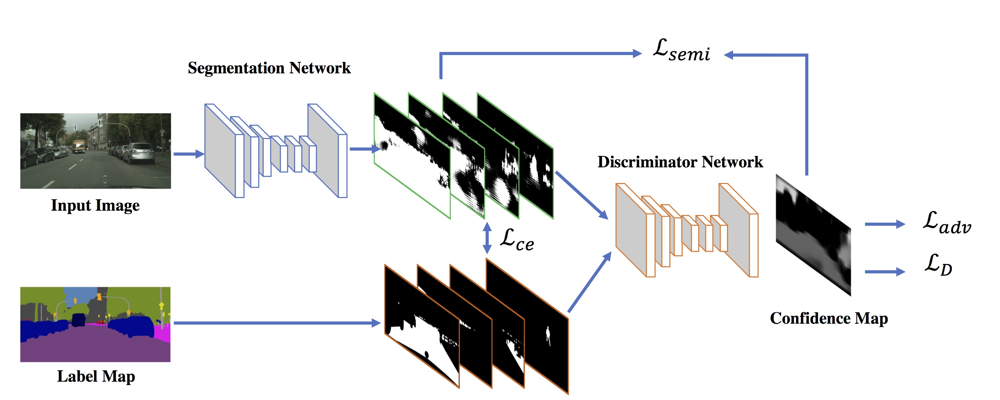
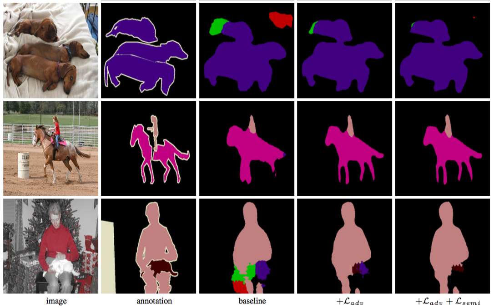

# Adversarial Learning for Semi-supervised Semantic Segmentation

This repo is the pytorch implementation of the following paper:

[Adversarial Learning for Semi-supervised Semantic Segmentation]() <br/>
[Wei-Chih Hung](https://hfslyc.github.io/), [Yi-Hsuan Tsai](https://sites.google.com/site/yihsuantsai/home), Yan-Ting Liou, [Yen-Yu Lin](https://www.citi.sinica.edu.tw/pages/yylin/), and [Ming-Hsuan Yang](http://faculty.ucmerced.edu/mhyang/) <br/>

Contact: Wei-Chih Hung (whung8 at ucmerced dot edu)



The code are heavily borrowed from a pytorch DeepLab implementation ([Link](https://github.com/speedinghzl/Pytorch-Deeplab)). The baseline model is DeepLabv2-Resnet101 without multiscale training and CRF post processing, which yields meanIOU ``73.6%`` on the VOC2012 validation set. 

Please cite our paper if you find it useful for your research.
```
@article{Hung_semiseg_2018,
  author = {W.-C. Hung and Y.-H. Tsai and Y.-T. Liou and Y.-Y. Lin and M.-H. Yang},
  journal = {arXiv preprint arXiv:xxxx.xxxxx},
  title = {Adversarial Learning for Semi-supervised Semantic Segmentation},
  year = {2018}
}
```

## Prerequisite

* CUDA/CUDNN
* pytorch >= 0.2
* python-opencv >=3.4.0 (3.3 will cause extra GPU memory on multithread data loader)


## Installation

* Clone this repo

```bash
git clone https://github.com/hfslyc/AdvSemiSeg.git
```

* Place VOC2012 dataset in `AdvSemiSeg/dataset/VOC2012`. For training, you will need the augmented labels ([Download](http://vllab1.ucmerced.edu/~whung/adv-semi-seg/SegmentationClassAug.zip)). The folder structure should be like:
```
AdvSemiSeg/dataset/VOC2012/JPEGImages
                          /SegmentationClassAug
```

## Testing on VOC2012 validation set with pretrained models

```
python evaluate_voc.py --pretrained-model semi0.125 --save-dir results
```

It will download the pretrained model with 1/8 training data and evaluate on the VOC2012 val set. The colorized images will be saved in ``results/`` and the detailed class IOU will be saved in ``results/result.txt``. The mean IOU should be around ``68.8%``.

* Available ``--pretrained-model`` options: ``semi0.125``, ``semi0.25``, ``semi0.5``. 

## Example visualization results




## Training on VOC2012

```
python train.py --snapshot-dir snapshots \
                --partial-data 0.125 \
                --num-steps 20000 \
                --lambda-adv-pred 0.01 \
                --lambda-semi 0.1 --semi-start 5000 --mask-T 0.2
```

The parameters correspond to those in Table 5 of the paper.

To evaluate trained model, execute the following:

```
python evaluate_voc.py --restore-from snapshots/VOC_20000.pth \
                       --save-dir results
```


